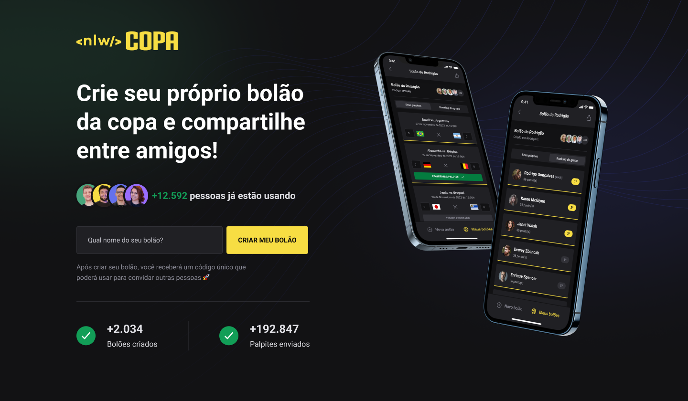

<p align="center">
  
</p>

<p align="center">
  
  <a href="LICENSE"></a>
</p>

---



## 💻 Projeto

 Essa aplicação foi desenvolvida durante a NLW COPA, decima edição ministrada pela [Rocketseat](https://github.com/rocketseat).

 O objetivo dessa aplicação é fazer com que o usuário crie e compartilhe bolões entre os amigos.

## ✨ Tecnologias

- [TypeScript](https://www.typescriptlang.org/)
- [React](https://reactjs.org/)
- [React Native](https://reactnative.dev/)
- [Expo](https://expo.dev/)
- [Fastify](https://www.fastify.io/)
- [Prisma](https://www.prisma.io/)
- …

## 🚀 Como executar

Clone o repositório do projeto e acesse a pasta.

```bash
$ git clone https://github.com/rafael-camara/boloes-copa.git
$ cd boloes-copa
```

Acesse a documentação de cada projeto para a instalação das dependências:

- [Server](./server/README.md)
- [Web](./web/README.md)
- [Mobile](./mobile/README.md)

## 🔖 Layout

Você pode visualizar o layout do projeto através do link abaixo:

- [Layout](https://www.figma.com/community/file/1169028343875283461)

Lembrando que você precisa ter uma conta no [Figma](http://figma.com/).

## 📝 License

Esse projeto está sob a licença MIT. Veja o arquivo [LICENSE](LICENSE) para mais detalhes.

---

Feito com 💜 by [Rafael Câmara](https://github.com/rafael-camara)